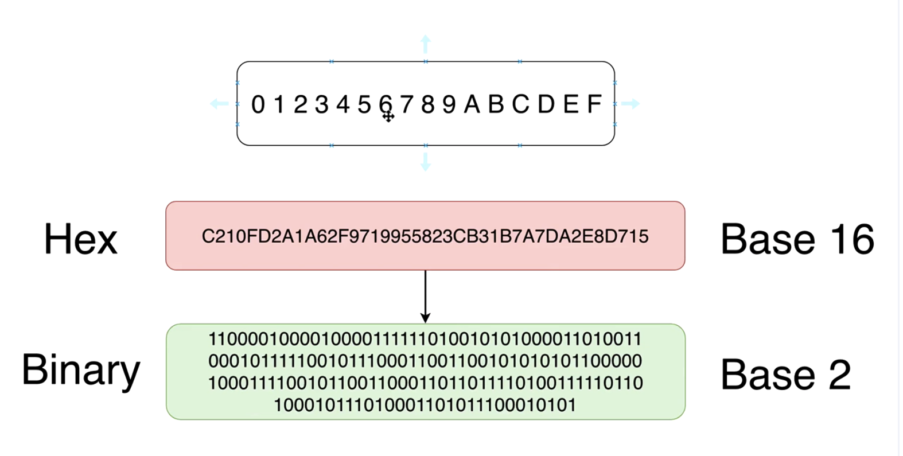
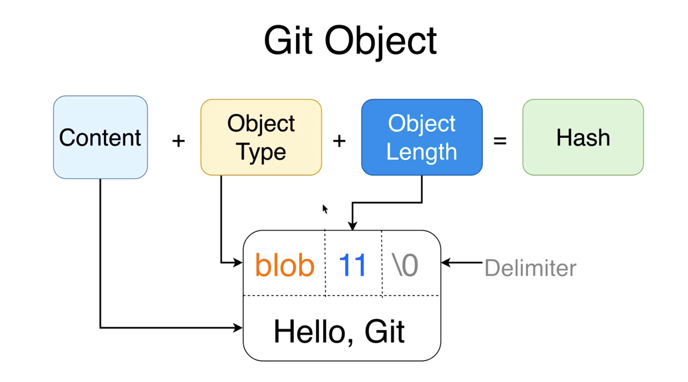

# Coursera | Complete Git Guide: Understand and Master Git and GitHub Specialization

[Specialization Link](https://www.coursera.org/specializations/packt-complete-git-guide-understand-and-master-git-and-github)


## Course 1 | Git Fundamentals – Getting Started with Git and GitHub
[Course 1 Link](https://www.coursera.org/learn/packt-git-fundamentals-getting-started-with-git-and-github-rf1ze?specialization=packt-complete-git-guide-understand-and-master-git-and-github)

### Module 1: Intro & Course Structure.     
[Repo](https://github.com/skibodaria/Coursera-Packt-Complete-Git-Guide)

1. **Introduction to Git and GitHub**: In this module, we will introduce you to Git and GitHub, covering their significance in version control and software development. We’ll also distinguish between Git and GitHub, shedding light on their distinct roles. This section will set the foundation for your journey through Git and GitHub, focusing on the core concepts you'll need to understand.

2. **Installation of Git and Configuration of the Shell**: In this module, we will guide you through the installation process of Git on various operating systems, ensuring smooth setups on macOS, Windows, and Linux. Additionally, we’ll configure the shell environment, enhancing your Git experience on macOS with iTerm2 and Zsh for improved terminal functionality.

3. **Basic Shell Commands**: In this module, we will introduce you to essential shell commands used in Git workflows, focusing on directory and file management. By the end of this section, you'll be able to navigate the command line, create, copy, move, and delete files—all vital skills for managing your Git repositories.

4. **How Git Works Under the Hood**: In this module, we will explore Git’s internal mechanisms, including the object model and the contents of the .git folder. You’ll dive deep into how Git stores and manages data, gaining a comprehensive understanding of objects like blobs, trees, and commits. We’ll also cover Git's use of hash functions to ensure data integrity and prevent collisions.

5. **Basic Git Operations**: In this module, we will cover the basic Git operations that are essential for version control. From creating your first commit to understanding the file lifecycle, we’ll ensure you are comfortable managing files, making commits, and navigating your Git project. This section lays the groundwork for more advanced Git workflows.

6. **Git Branches and `HEAD`**: In this module, we will focus on Git branches and the `HEAD` reference, which are critical for managing different lines of development. You’ll learn how to create, manage, and switch between branches, as well as explore how these concepts fit into a version control workflow. This section will help you navigate Git’s branching model with confidence.

### Module 2: Git and GitHub
1. **Git** is distributed version-control system; hashes the file/folders versions; keep them all; doesn't need internet connection; allows to get access to all historical versions of files;
2. **Git-Hub** is a hosting platform; perfect for collaborations; has features beyond just version control (e.g., one can host a web-site on GitHub); allows restore the repo even if it was removed locally.

### Module 3: Shell Commands
```bash
pwd             # current directory
ls              # list files / folders in the current directory
ls -l           # in table format
ls -la          # including hidden files
ls -a           # hidden files, no table

cd              # change to home folder
cd Desktop      # change directory to Desktop
cd ~            # changes directory to Home

clear           # clear tetminal

mkdir <name>    # create directory with name <name>

touch <file.xxx>    # create a file with name <file> and format <.xxx>

..              # alias for parent directory
cd ..           # changes directory to parent
.               # alias for current pirectory

open .          # opens current directory (MAC!)
start .         # opens current directory (WINDOWS!)

~ cd Desktop/new-folder  # change directory according to the path given (if exists)

nano                    # opens terminal text editor
vim                     # another text editor (also inside the shell)

nano test.txt           # opens this file in nano (PICO!)
control + o             # write changes
enter                   # commit
control + x             # exit

Tab                     # autocompletes the statement
TabTab                  # shows more options

echo                    # print to terminal
echo Hello, World!      # prints Hello, World! in terminal
echo 'Hello World!'     # also prints
echo "Hello World\!"     # will work with "" but needs to escape \!

man                     # manual on specific command
man clear               # gives manual for HELP command
man touch               # manual about TOUCH including all the options

help                    # lists possible commands/options

>                       # write to the file
echo "ANOOOOOOOOTHER FILE" > new_test.txt

>>                      # append to the file
echo "HELLO WOOOOOOOOOOOORLD" >> test.txt
echo "one more line just to check" >> test.txt

cat                     # list contents of the file
cat new_test.txt

rm <file_name>          # remove a file
rm -rf <name_of_folder> # removes a folder (stands for recursively remove + force)
```

**Relative Path**: if you don't start with `/` the path is **always relative** to the current directory.

**Absolute Path** always starts with `/`.

**Nota Bene**: With `man nano` I get manual for `pico`. Whyy?

### Module 4 | How Git Works Under the Hood
```bash
git init                                                    # initialize a new git repository
ls -la                                                      # will show hidden folders/files
>> Coursera-Packt-Complete-Git-Guide git:(main) ✗           # git: means that it's under git control; (main) insicates the branch
```

Creates a new hidden folder `.git/`. If the follder is empry, the new empty repo will be created.
What's in `.git/`?
```bash
➜  .git git:(main) ls -la
total 48
drwxr-xr-x@ 13 dariaskibo  staff   416 Jul 15 15:27 .
drwxr-xr-x@ 23 dariaskibo  staff   736 Jul 15 16:59 ..
-rw-r--r--@  1 dariaskibo  staff    12 Jul 15 15:27 COMMIT_EDITMSG
-rw-r--r--@  1 dariaskibo  staff    21 Jul 14 22:56 HEAD
-rw-r--r--@  1 dariaskibo  staff   362 Jul 14 22:56 config
-rw-r--r--@  1 dariaskibo  staff    73 Jul 14 22:56 description
drwxr-xr-x@ 16 dariaskibo  staff   512 Jul 14 22:56 hooks
-rw-r--r--@  1 dariaskibo  staff  3733 Jul 15 15:27 index
drwxr-xr-x@  3 dariaskibo  staff    96 Jul 14 22:56 info
drwxr-xr-x@  4 dariaskibo  staff   128 Jul 14 22:56 logs
drwxr-xr-x@ 14 dariaskibo  staff   448 Jul 15 15:26 objects
-rw-r--r--@  1 dariaskibo  staff   112 Jul 14 22:56 packed-refs
drwxr-xr-x@  5 dariaskibo  staff   160 Jul 14 22:56 refs
```

`Command + Shift + .` = to see hidden files on Mac

**NOTA BENE: NEVER DO ANYTHING TO THE CONTENT OF THIS FOLDER!!!!**

Check the content of some of the files:

```bash
➜  .git git:(main) cat config
[core]
        repositoryformatversion = 0
        filemode = true
        bare = false
        logallrefupdates = true
        ignorecase = true
        precomposeunicode = true
[remote "origin"]
        url = git@github.com:skibodaria/Coursera-Packt-Complete-Git-Guide.git
        fetch = +refs/heads/*:refs/remotes/origin/*
[branch "main"]
        remote = origin
        merge = refs/heads/main
        vscode-merge-base = origin/main
```

```bash
➜  .git git:(main) cat description 
Unnamed repository; edit this file 'description' to name the repository.
```

```bash
➜  .git git:(main) cat HEAD 
ref: refs/heads/main
```

Git has it's own file system. It stores objects in the folder `objects\`. Which types of objects Git can store?
- **`BLOB`**: any *files* with any extentions;
- **`THEE`**: *information* about directories; can be set of trees or blobs and trees;
- **`COMMIT`**: versions of projects;
- **`ANNOTATED TEG`**: persistent text pointer to a specific commit.

To operate blobs and trees, we will use **low-level Git commands**:
```bash
git hash-object     # create a new object in Git structure
git cat-file        # read Git objects
git mktree          # create new tree objects
```

Let's create a **`BLOB`**:
```bash
echo "Hello, Git" | git hash-object --stdin
>> b7aec520dec0a7516c18eb4c68b64ae1eb9b5a5e

echo Hello Git | git hash-object --stdin
>> 9f4d96d5b00d98959ea9960f069585ce42b1349a
```
| sends the output to the next command
--stdin means that we take it from standard input (?)

If we check the contents of the `.git` folder, nothing would change there. We neet to write to a file:
```bash
echo Hello Git | git hash-object --stdin -w
9f4d96d5b00d98959ea9960f069585ce42b1349a
```

With `-w` we wrote to a file -> we created a new folder (starts with `9f` and `b7`) with two new objects. If you contatinate the name of the folder + the name of the file -> you will get the hash of "Hello, Git" and "Hello Git". These files are created ONLY in the `.git\` folder.


#### **JSON** 
JavaScript Object Notation: data exchange between servers (e.g., API -> browser, database -> server, etc)

```JSON
{
    "id": "1234567",
    "name": "Mike",
    "age": 25,
    "city": "New York",
    "hobbies": ["Skateboarding", "Running"] 
}
```

- Why we talk about it: pairs of key:values -> key should be unique. But values can repeat.
- Same idea with Git: key in Git is generated based on value. So the values are unique too.

#### **Hash Function**
In Git, we store files based on their hash.
- takes any length variable
- creates a defined (unified) hash string of a particular (fixed) length;
- ANY file;
- if you know hash but not input, you can't recreate it; it's **one-way function**;
- example: passwords;
- **always generates same hash from the same input**.

Some hash-functions:
- **MD5** (128 bit): [try](https://www.md5hashgenerator.com/)
- **SHA1** (160 bit)
    > git uses it!
- **SHA256** (256 bit)
- **SHA384** (384 bit)
- **SHA512** (512 bit)

Why bits? But why we see a normal string?...
`b7aec520dec0a7516c18eb4c68b64ae1eb9b5a5e` = [Hexadecimal](https://en.wikipedia.org/wiki/Hexadecimal) format (taadaaaaaam)
so it has only: 0-1-2-3-4-5-6-7-8-9-A-B-C-D-E-F

#### SHA1 Hash Function
- used by Git
- 160 bits = 40 hexadecimal characters
- [wiki](https://en.wikipedia.org/wiki/SHA-1)
- is **Base 16** (e.g., binary = Base 2)
- lower/upper case doesn't matter



- even small change of input data leads to creation of TOTALLY different hashes;

- generate SHA1 in terminal:
```bash
man shasum                      # manual on shashum utility
echo "Hello, Git"               # prints to terminal
echo -n "Hello, Git"            # remove the line break in the end (IMPORTANT FOR HASHES)
echo "Hello, Git" | shasum
>> c9d5d04925b93d2fb99c73ab2b5869bde7405ca4

echo -n "Hello, Git" | shasum
>> 0a2b198f595e55060dec9f0e196c10de86f2ca1c

echo -n 'Hello, Git!' | shasum
>> 1d4d7d92f79dc328154dc91424e6e740f8f5a563
```

**NOTA BENE: `echo` wil allways add newline in the end of the thing!**

#### How Much Can I Store?

**1. How Many Files Git Can Store in the Same Repo?**

Combinations: `2^2 = 4` combinations (0 and 1 for two positions); `2^3 = 8` combinations (of 1 and 0 for 3 combinations)

For SHA1:
- 160 bits is the length of SHA1 hash
- if binary format: on each of the 160 positions, it will be eithe 0 or 1 -> the result is `2^150`
- this is the amount of files git can save in the same repo; I can't count how many of combinations it is; it's a very big number
- it's the number of possible SHA1 combinations (or `16^40`);

**2. What Is the Chance of Profucing the Same *EXACT* Hash? Collision**
- what is the probability of hash collisions?
> **Dice Game Recap**:  
> * we get a regular dice; and throw it; probability to get a certain number on two dices is `1/6 * 1/6 = 1/36 = 0.028` (probabilty of same number on two dices)
> * probability of the two differnt dices (two specific not matching numbers) will be `0.028 * 2 = 0.056 ~6%`;
- what is the probability of each SHA1 hash will be: `1/(2^160)`, which is a very small number of `6.8.....1e-49` (scientific small numbers format); suuuuuuuper small number (`0.000000000000000000000000000000000000000000000000068`)
- to get probability of SAME hash for **TWO** files, we need to `1/(2^160) * 1/(2^160) = 1/(2^320) = 0.00(96 zeroes)004`; this number is **incredibly small**;
- it will ALMOST never happen in your repo; you can be sure that every file has a distinct hash.

#### More Details on Hash Collision Probability (Optional)
What is the chance of producing sme **any** hash for different files? = Hash Collision

**1. Dice Game Recap Again**
- Probability of each SHA1 hash is `1/(2^160)`
- Probability of any same-dice pair is `1/36`, of a different-dice pair is `(1/36) * 2`
- Probabilty of ALL same-dice pair is `1/6 * 1/6 * 6 = 1/6 ~17%` (quantity of "successes" is 6, and probability of one result is 1/6);
- Probabilty of ALL (any) same-dice triples is: `1/6 * 1/6 * 1/6 * 6 = 1/36 ~3%`
- Probability of ALL (any) same-numbers on N dices is: `1/6 * 1/6 * 1/6 * ... * 1/6 * 6 = (1/(6^N)) * 6 = 1/6^(N-1)`
- Probabilty of ANY same number on ANY PAIR of three dices: `1/6 * 1/6 * 1/6 * 96 = 16/36 ~44%`(why: you first get all possible combination of successes: `6*6 + 6*6 +5*6`)
- How can we extend it to any number of dices? -> 
- Probility of **all different** numbers on **all** dices:

`6/6 * 5/6 * ... * ((6+1-N)/6) = (5!)/((6-N!)*6^(N-1))`
- Example with 4 dices:

`6/6 * 5/6 * 4/6 * 3/6 =360/1296 ~ 27%`
        - 6/6 for the first dice: we are happy woth any result
        - 5/6 for the second dice (be we are already not happy with at least one result)
        - ... 
        - why we didn't count successfull outcomes here?
`5! = 5 * 4 * 3 * 2* 1`= factorial

- What is the probability of getting at least two SAME numbers? `100% - 27%`.

- General formula: `1 - 6/6 * 5/6 * ... * ((6+1-N)/6) = 1 - ((5!)/((6-N!)*6^(N-1)))`
> - N = 2 -> 0.17
> - N = 3 -> 0.44
> - N = 4 -> 0.72
> - N = 5 -> 0.91
> - N = 6 -> 0.99
> - N > 6 ->  1 

**2. Probability Theory on Git**
- Probability of ANY same SHA1 hash on ANY PAIR of N files:

$$1 - \left( \frac{(2^{160} - 1)!}{(2^{160} - N)! \cdot 2^{160 \cdot (N - 1)}} \right)$$

In a set of $N$ randomly generated hashes from a space of size $H = 2^{160}$, the probability $P$ of at least one collision is:$$P(N) \approx 1 - \frac{H!}{H^N (H - N)!}$$

Collision Probability Formula

The probability of encountering at least one collision after generating $N$ hashes in a space of $H = 2^{160}$ is expressed as:$$P(N) = 1 - \frac{\prod_{i=0}^{N-1} (H - i)}{H^N}$$Alternatively, using the factorial notation you requested (which is functionally equivalent to the term involving the product):$$P(N) = 1 - \frac{H!}{H^N (H - N)!}$$
Technical Notes:
- $H = 2^{160}$: This is the total hash space.
- $N$: The number of items (hashes) you have generated.
- $H^N$: The total number of possible ways to assign $N$ items to $H$ buckets (with replacement).
- $\frac{H!}{(H-N)!}$: The number of ways to assign $N$ items to $H$ buckets such that no collisions occur (the permutations of $N$ items chosen from $H$).

> With N = 2 (two files), the probability of hash collision is `6.84e-49`
> With N = 3 (three files), the probability of hash collision is `2.05e-48`

If the quantity of files in repo is more than 2^160, than we will **DEFINITELY** get a hash collision.


Gemini note:

Even with 7 trillion ($7 \times 10^{12}$) files, the probability of a SHA-1 collision remains effectively zero.

Using the same approximation formula, $P(N) \approx 1 - e^{-\frac{N^2}{2H}}$:
- Number of files ($N$): $7 \times 10^{12}$
- $N^2$: $4.9 \times 10^{25}$
- $2H$ ($2 \times 2^{160}$): $\approx 2.92 \times 10^{48}$
- Calculated exponent: $-\frac{N^2}{2H} \approx -1.68 \times 10^{-23}$

The probability is approximately $1.68 \times 10^{-23}$.

Contextualizing the scale: 

To put this into perspective, even if you were hashing 7 trillion files every single second, it would take billions of years for the cumulative probability of a collision to reach a level that might be considered "statistically significant" in any practical sense.The hash space of $2^{160}$ is so incomprehensibly large that, even at a global scale of trillions of files, SHA-1—while cryptographically "broken" regarding intentional collision attacks—remains perfectly robust for standard file integrity checks, checksums, and repository management.

#### Low-Level Comands
```bash
git hash-object                         # allows to create a blob
git cat-file <hash>                     # allows to work with git files (explore the content)
git cat-file -p <hash>                  # contents of the object
git cat-file -s <hash>                  # size of the object
git cat-file -t <hash>                  # type of the object
git mktree
```

Examples:
```bash
git cat-file -p b9c036cb62a064288df1f7b5b057159299fd4752
>>> ANOOOOOOTHER FILE
>>> one more line just to check
>>> 
>>> Wow, another file to edit in Pico.
>>> Emerson is losing his patience and wants a break.
>>> And sleep.
>>> .

git cat-file -t b9c036cb62a064288df1f7b5b057159299fd4752
>>> blob

git cat-file -s b9c036cb62a064288df1f7b5b057159299fd4752 
>>> 145 # bites!
```

If we try to do it on non-existing object: `fatal: git cat-file: could not get object info`

#### Creating A New Git Blob Based on a File
How we created a git object before:
```bash
echo 'Hello, Git' | git hash-object --stdin -w # standard input option and write option
```

Now we can create a hash object from a file: `git hash-object <filename> -w`
```bash
git hash-object ~/Desktop/new_file.txt          # will NOT create a file!
>> 4400aae52a27341314f423095846b1f215a7cf08

git hash-object ~/Desktop/new_file.txt -w       # will create a file!
>> 4400aae52a27341314f423095846b1f215a7cf08

git cat-file -p 4400aae52a27341314f423095846b1f215a7cf08
>> Second file in Git repository

git cat-file -t 4400aae52a27341314f423095846b1f215a7cf08
>> blob

git cat-file -s 4400aae52a27341314f423095846b1f215a7cf08
>> 30
```

Deletion of the original file **does not affect** the git repo.

NOTA BENE: WHen we created a git object from echo/string (using git hash-object), we didn't need a <filename> to make it work. Why? Because git blobs **do not have filenames**.

#### Why Git Blobs Do Not Store Filenames
- each blob has a name; but it based on SHA1 hash for each object;
- when we create a git object from a file, the filename (of the original file) is **NOT** stored in the git object;
- even git command `git cat-file` doesn't have an option to read / retrieve filename again BECAUSE BLOBS DO NOT STORE FILENAMES;
- each blob stores information about its TYPE and SIZE;
- blobs are just very binary;
- we created two hash-objects using `git hash-object` command and using `shasum` utility; but the resulting hashes for the same string was TOOOOOTALLY different; why? because of the type/size thing:

### Contents of Git Objects



Each object has four fields:
- **content**('Hello, Git')
- **object type **(blob)
- **object length **(11 bites)
- **delimeter** (`\0`) just shows that the content will start after

If we try to read git-object directly, it won't give anything: `cat 00aae52a27341314f423095846b1f215a7cf08 ` -> in order to convert ninary format to readable one, you can install Python `zlib`, but it won't happen in the lecture.

The point is, that
- git-object created for "Hello, Git" using hash-object (starts with `b7`)
- and the result of using `shasum` utility on the string `blob 11\0Hello, Git`,
- are giving EXACTLY the same result
- which PROVES that hash-objects include type + size + delimeter (and the content) in itselt;

```bash
"echo "blob 11\0Hello, Git" | shasum   
>>> b7aec520dec0a7516c18eb4c68b64ae1eb9b5a5e
```

Careful with \0 and escaped characters (different terminals behave differently with them; use `-e` as an option to escape it). Make sense of -e (hidden) and no escape character at all.


### Module 5 | Basic Git Operations


### Module 6 | Git Branches and `HEAD`

--- 

## Course 2 | Master Version Control – Branching, Merging, Collaboration
[Course 2 Link](https://www.coursera.org/learn/packt-master-version-control-branching-merging-collaboration-psnjz?specialization=packt-complete-git-guide-understand-and-master-git-and-github)

### Module 1 | CLoning, Exporting, and Modifying Public Repos

### Module 2 | Merging Branches

### Module 3 | GitHub and Remote Repos

### Module 4 | `git push`, `git fetch`, and `git pull`

### Module 5 | Pull Requests

### Module 6 | Forks and Contribution to Public Repos


---

## Course 3 | Advanced Git and GitHub – Optimization and Automation
[Course 3 Link](https://www.coursera.org/learn/packt-advanced-git-and-github-optimization-and-automation-cfv1x?specialization=packt-complete-git-guide-understand-and-master-git-and-github)

### Module 1 | Git Tags

### Module 2 | Rebasing

### Module 3 | Ignoring Files in Git

### Module 4 | Advanced Git

### Module 5 | GitHub Pages

### Module 6 | GitHub Hooks

### Module 7 | Wrap Up

